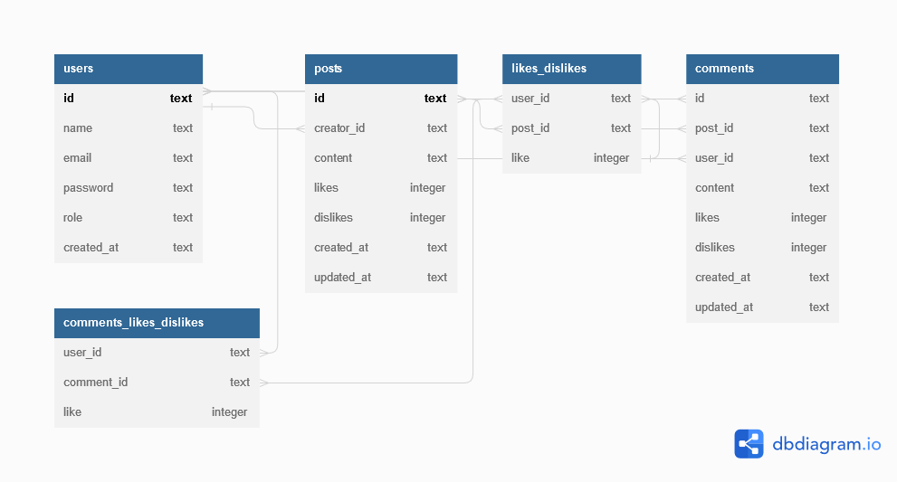

<h1 align="center">
     Labeddit - Back End
</h1>

<h4 align="left">
    O Reddit da Labenu! 
</h4>

##  🕵Sobre

Neste repositório você encontra a API para uma rede social do estilo Reddit com a marca visual da Labenu, escola onde me formei como desenvolvedor Full-Stack. Este é o repositório do Back-End deste projeto e o repositório para o Front-End se encontra no seguinte link: https://github.com/Rottschaefer/LabEddit

##  👩🏾Quem Faz 

- Eduardo Rottschaefer Oliveira

Conecte-se comigo no LinkedIn! - https://www.linkedin.com/in/eduardo-rottschaefer

##  🔠Conteúdos

<!--ts-->
   * [Sobre](#sobre)
   * [Quem Faz](#-quem-faz)
   * [Status](#status)
   * [Objetivo do Projeto](#objetivo-do-projeto)
   * [Requisitos de Funcionalidade](#requisitos-de-funcionalidade)
   * [Concepção do Projeto](#concepcao-do-projeto)
   * [Link para Acessar](#link-para-acessar)
   * [Rodando o Projeto](#rodando-o-projeto)
   * [Sobre a Licença](#sobre-a-licença)
<!--te-->

---
##  🧭Status do Projeto

 - ⌛ Feito

---

##  🎯Objetivo do Projeto

Esta é um projeto de Full-Stack, desenvolvido no bootcamp da Labenu, cujo o principal objetivo é aplicar tudo o que foi aprendido ao longo do curso.

## ☑️Requisitos de Funcionalidade

- [x] Endpoints seguindo as boas práticas HTTP
- [x] Uso do ExpressJS, Typescript e SQLite
- [x] Cobertura de testes
- [x] Documentação POSTMAN
- [x] API deployada

## 💡Concepção do Projeto

Para esse projeto são modeladas três tabelas principais : **Usuários (users), Postagens (posts)** e **Comentários(comments)**.  Cada um com as seguintes caracteristicas :

→ Usuários -  id, nome, email, senha, função(administrador ou não) e horário de criação;

→ Postagens - id, id do criador do post, conteúdo, likes, dislikes e horário de criação. ;

→ Comentários - id, id do post no qual foi feito o comentário, id do usuário que o criou, conteúdo, likes, dislikes e horário de criação.

---

## 🔗Link para Acessar

- **Caminho para utilizar a API via requisições HTTP:** https://labeddit-backend-npai.onrender.com

---

## 🛰Rodando o Projeto

- Faça um clone deste repositório em sua máquina com o comando git clone https://github.com/Rottschaefer/labook-backend
- Abra o arquivo do projeto pelo terminal
- Execute o comando npm install
- Execute o comando npm run dev
- Pronto! Agora a aplicação já está rodando em sua máquina :)
- Aproveite o Projeto :)
---

## 📝Sobre a Licença

Este projeto esta sobe a licença [MIT](./LICENSE).
